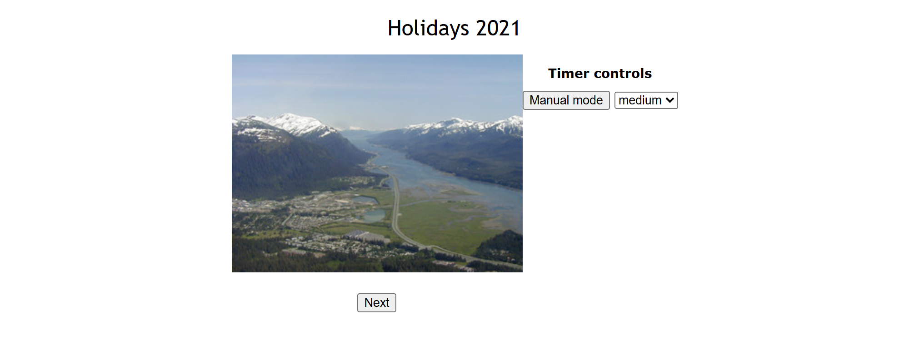
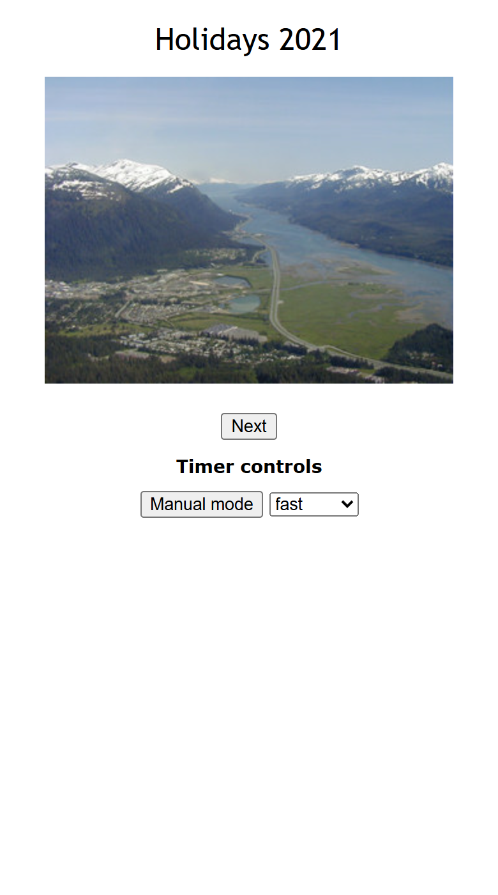

# photo-slideshow

Seven holiday photographs, a Next button, and an automatic mode that turns
the pages for you at one of three speeds. The whole automatic part is one
`setInterval`, started, stopped and restarted as the speed changes.

HTML, CSS and vanilla JavaScript. No framework, no build step, no dependency:
open the file and press Auto mode.

## Screenshots

## How it works

**One timer, held in one variable.** `startTimer` calls
`setInterval(next, currentDelay)` and keeps the id; `stopTimer` hands that
id to `clearInterval`. Everything else is deciding when to call which.

**Changing speed means stopping and starting again.** A running interval
keeps the delay it was created with, so `changeSpeed` stores the new delay,
then, if auto mode is on, stops the timer and starts it with the new value.
In manual mode it only stores the delay for the next start.

**One button, two states.** `toggleAutoMode` flips a flag; on, it starts the
timer and the button reads Manual mode; off, it stops the timer and the
button reads Auto mode. The manual Next button keeps working in both.

**The speeds are constants.** `FAST`, `MEDIUM` and `SLOW` are 500, 1000 and
1500 milliseconds, looked up from the list's value through one small table.

**The last slide wraps to the first.** `next` increments the index and
resets it to zero after the seventh photograph, updating both the source
and the alt text so the caption always matches the picture.

## Running it

Open `index.html` in a browser. There is nothing to install.

## Stack

HTML, CSS and vanilla JavaScript. One stylesheet, one script, seven
photographs.

## Résumé

Visionneuse de sept photographies de vacances, avec un bouton Suivant et un
mode automatique qui fait défiler les images à l'une de trois vitesses. Tout
le mode automatique tient en un `setInterval`, conservé dans une variable,
arrêté par `clearInterval`. Changer de vitesse arrête la minuterie et la
redémarre avec le nouveau délai, parce qu'un intervalle en cours garde celui
de sa création ; en mode manuel, seul le délai est mémorisé pour le prochain
démarrage. Un bouton bascule entre les deux modes et change de libellé. Les
trois vitesses sont des constantes, 500, 1000 et 1500 millisecondes. Après la
dernière photo, on revient à la première, source et texte de remplacement
mis à jour ensemble.

## Licence

MIT. See [LICENSE](LICENSE).
